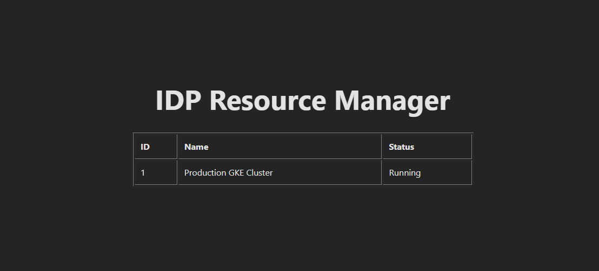
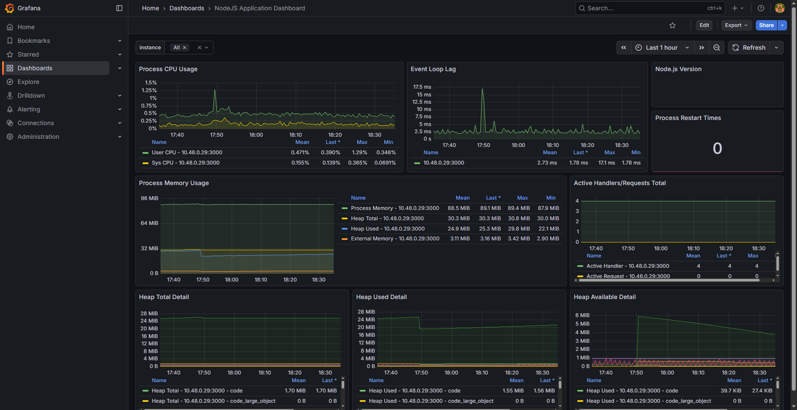
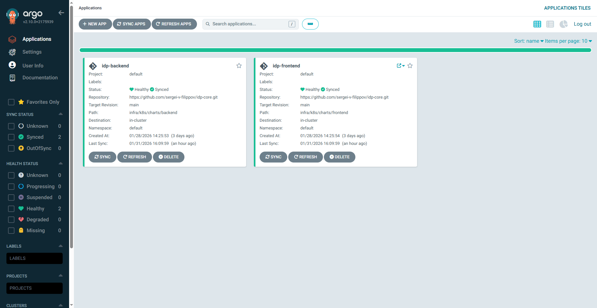
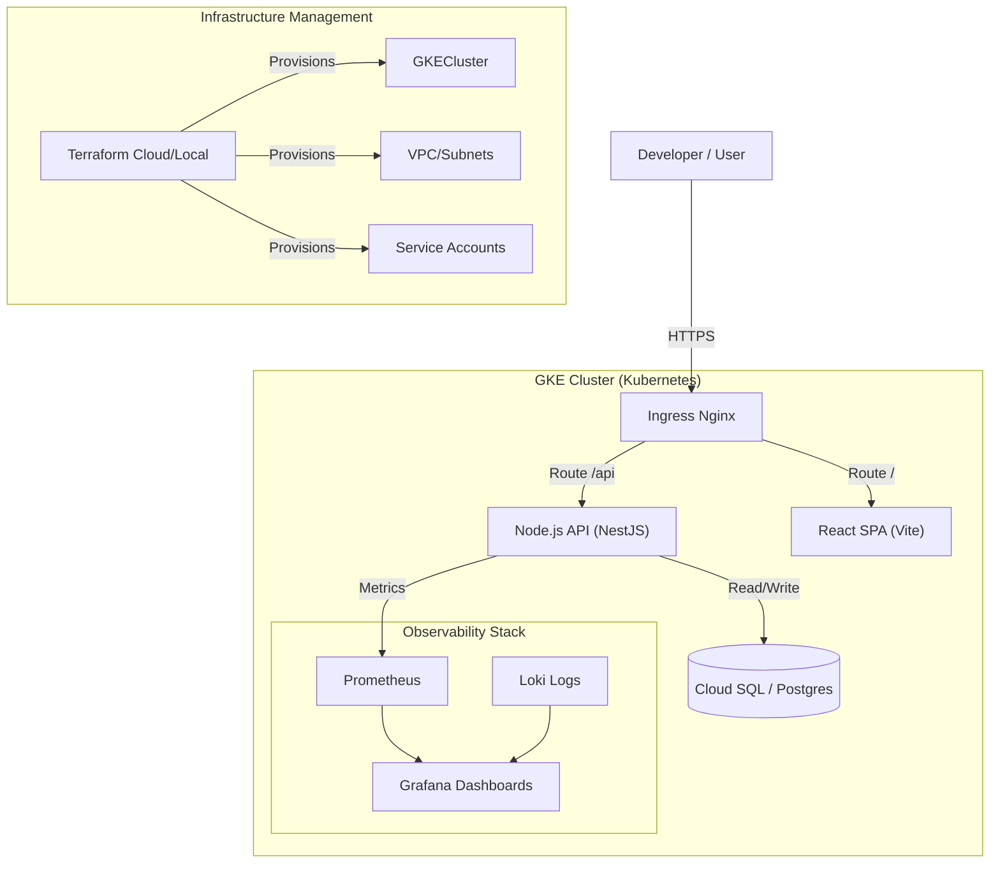
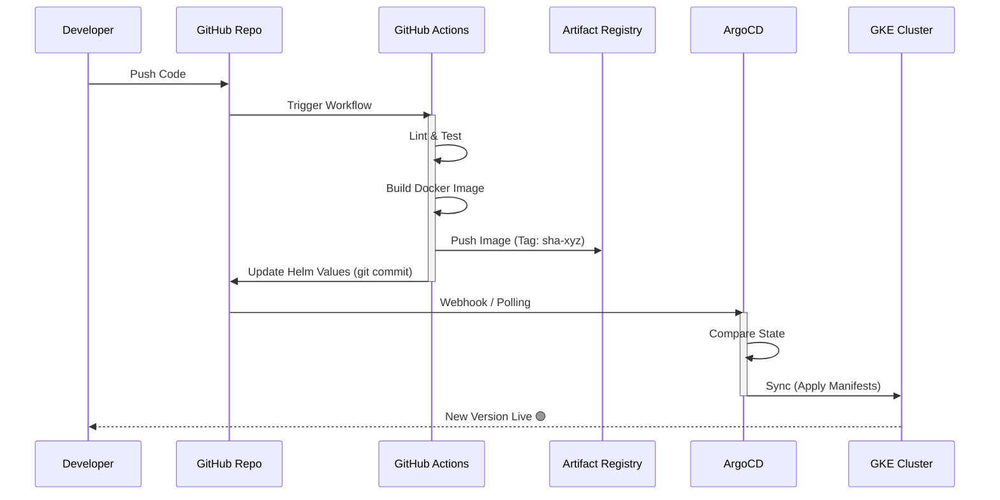

# IDP Core Reference Architecture


## Overview

**IDP Core** is a reference architecture for a modern **Internal Developer Platform**, designed to reduce cognitive load for engineering teams and accelerate Time-to-Market.

This repository serves as a **sanitized technical demonstration** ("Walking Skeleton") based on patterns I successfully implemented for recent FinTech and High-Load projects. It showcases a production-ready approach to Infrastructure as Code, GitOps, and Observability.

> **Note:** Business logic has been stripped out to comply with NDA requirements. This repo focuses on the architectural backbone: Infrastructure, CI/CD pipelines, and the Platform Interface.

---

## Platform Preview

### 1. Developer Portal (React Frontend)
The frontend communicates with the backend API via secure Ingress.


### 2. Observability (Grafana)
Real-time application metrics (RPS, Latency) automatically scraped by Prometheus.


### 3. GitOps Delivery (ArgoCD)
Zero-touch deployment: ArgoCD automatically syncs cluster state with the Git repository.


---

## Architecture

The platform is built on **Google Cloud Platform (GKE)**, utilizing a **BFF (Backend for Frontend)** pattern to decouple the UI from core infrastructure services.


---

## CI/CD & GitOps Flow
The delivery pipeline is fully automated using GitHub Actions for CI and ArgoCD for CD (GitOps), ensuring zero-downtime deployments.


---

## Tech Stack

### Platform & Infrastructure
*   **Cloud:** Google Cloud Platform (GCP)
*   **IaC:** Terraform (Modular architecture)
*   **Orchestration:** Kubernetes (GKE Autopilot/Standard)
*   **GitOps:** ArgoCD

### Application Layer
*   **Frontend:** React 18, TypeScript, Redux Toolkit (RTK Query), TailwindCSS / AntD.
*   **Backend:** Node.js (NestJS), TypeORM/Prisma.
*   **Database:** PostgreSQL (Cloud SQL).

### Observability
*   **Metrics:** Prometheus Operator, ServiceMonitors.
*   **Logs:** Promtail + Loki.
*   **Visualization:** Grafana (Infrastructure & Business KPIs).

## Getting Started (Local Dev)

To spin up the local development environment using Docker Compose:

### 1. Clone the repository
```bash
git clone https://github.com/sergei-v-filippov/idp-core.git
```

### 2. Start services (Frontend + Backend + DB)
```bash
docker-compose up -d --build
```

### 3. Access the Platform
*   **Frontend:** http://localhost:3000
*   **Backend API:** http://localhost:4000/api
*   **Grafana:** http://localhost:3001

---

## ☁️ Deployment (Cloud)

Infrastructure provisioning is handled via Terraform:

```bash
cd infra/terraform
terraform init
terraform plan
# terraform apply (Requires GCP Credentials)
```

---

## Architecture Notes (Demo vs Production)

To ensure this repository remains portable and cost-effective for demonstration purposes, certain enterprise components were abstracted:

*   **Secrets Management:** Uses native Kubernetes Secrets for simplicity. In the live production environment, we utilized **Google Secret Manager** via External Secrets Operator.
*   **Database:** Uses an in-cluster PostgreSQL instance. Production utilized a highly available **Cloud SQL** instance with Private Service Connect.

---

## Author

**Sergei Filippov**  
Senior Platform Engineer | DevOps | Fullstack Infrastructure  
[LinkedIn Profile](https://www.linkedin.com/in/sergei-v-filippov/)
