# IDP Core Reference Architecture


## 📋 Overview

**IDP Core** is a reference architecture for a modern **Internal Developer Platform**, designed to reduce cognitive load for engineering teams and accelerate Time-to-Market.

This repository serves as a **sanitized technical demonstration** ("Walking Skeleton") based on patterns I successfully implemented for recent FinTech and High-Load projects. It showcases a production-ready approach to Infrastructure as Code, GitOps, and Observability.

> **Note:** Business logic has been stripped out to comply with NDA requirements. This repo focuses on the architectural backbone: Infrastructure, CI/CD pipelines, and the Platform Interface.

---

## 🏗 Architecture

The platform is built on **Google Cloud Platform (GKE)**, utilizing a **BFF (Backend for Frontend)** pattern to decouple the UI from core infrastructure services.


---

## 🚀 CI/CD & GitOps Flow
The delivery pipeline is fully automated using GitHub Actions for CI and ArgoCD for CD (GitOps), ensuring zero-downtime deployments.

```mermaid
sequenceDiagram
    participant Dev as Developer
    participant GH as GitHub Repo
    participant CI as GitHub Actions
    participant Reg as Artifact Registry
    participant Argo as ArgoCD
    participant K8s as GKE Cluster

    Dev->>GH: Push Code
    GH->>CI: Trigger Workflow
    activate CI
    CI->>CI: Lint & Test
    CI->>CI: Build Docker Image
    CI->>Reg: Push Image (Tag: sha-xyz)
    CI->>GH: Update Helm Values (git commit)
    deactivate CI
    
    GH->>Argo: Webhook / Polling
    activate Argo
    Argo->>Argo: Compare State
    Argo->>K8s: Sync (Apply Manifests)
    deactivate Argo
    K8s-->>Dev: New Version Live 🟢
```


---

## 🛠 Tech Stack

### Platform & Infrastructure
*   **Cloud:** Google Cloud Platform (GCP)
*   **IaC:** Terraform (Modular architecture)
*   **Orchestration:** Kubernetes (GKE Autopilot/Standard)
*   **GitOps:** ArgoCD

### Application Layer
*   **Frontend:** React 18, TypeScript, Redux Toolkit (RTK Query), TailwindCSS / AntD.
*   **Backend:** Node.js (NestJS), TypeORM/Prisma.
*   **Database:** PostgreSQL (Cloud SQL).

### Observability
*   **Metrics:** Prometheus Operator, ServiceMonitors.
*   **Logs:** Promtail + Loki.
*   **Visualization:** Grafana (Infrastructure & Business KPIs).

## 🚦 Getting Started (Local Dev)

To spin up the local development environment using Docker Compose:

### 1. Clone the repository
```bash
git clone https://github.com/sergei-v-filippov/idp-core.git
```

### 2. Start services (Frontend + Backend + DB)
```bash
docker-compose up -d --build
```

### 3. Access the Platform
*   **Frontend:** http://localhost:3000
*   **Backend API:** http://localhost:4000/api
*   **Grafana:** http://localhost:3001

---

## ☁️ Deployment (Cloud)

Infrastructure provisioning is handled via Terraform:

```bash
cd infra/terraform
terraform init
terraform plan
# terraform apply (Requires GCP Credentials)
```

---

## 👨‍💻 Author

**Sergei Filippov**  
Senior Platform Engineer | DevOps | Fullstack Infrastructure  
[LinkedIn Profile](https://www.linkedin.com/in/sergei-v-filippov/)